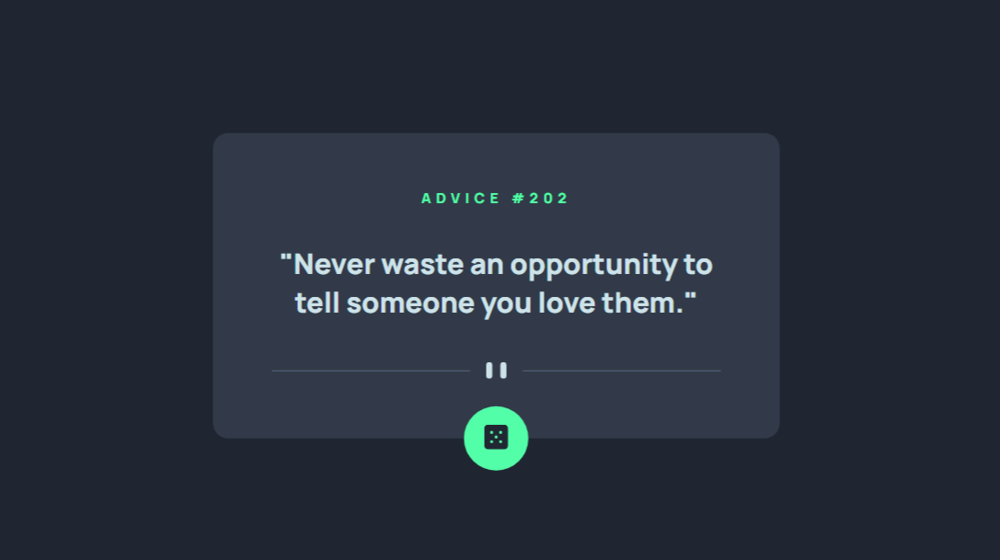

# Frontend Mentor - Advice generator app solution

This is a solution to the [Advice generator app challenge on Frontend Mentor](https://www.frontendmentor.io/challenges/advice-generator-app-QdUG-13db). Frontend Mentor challenges help you improve your coding skills by building realistic projects.

## Table of contents

- [Overview](#overview)
  - [The challenge](#the-challenge)
  - [Screenshot](#screenshot)
  - [Links](#links)
- [My process](#my-process)
  - [What I learned](#what-i-learned)
  - [Continued development](#continued-development)
- [Author](#author)

**Note: Delete this note and update the table of contents based on what sections you keep.**

## Overview

### The challenge

Users should be able to:

- View the optimal layout for the app depending on their device's screen size
- See hover states for all interactive elements on the page
- Generate a new piece of advice by clicking the dice icon

### Screenshot



### Links

- Solution URL: [Add solution URL here](https://your-solution-url.com)
- Live Site URL: [Add live site URL here](https://your-live-site-url.com)

## My process


### What I learned

```js
if (performance.getEntriesByType("navigation")[0].type === "reload") {
    const storedAdvice = localStorage.getItem('advice');
    const storedId = localStorage.getItem('id');

    if (storedAdvice && storedId) {
        document.querySelector('.id').innerHTML = storedId;
        document.querySelector('.quote').innerHTML = `"${storedAdvice}"`;
    } else {
        getquote(api_url);
    }
} else {
    getquote(api_url);
}
```

### Continued development

I would like to learn Node.js and the basics of backend to be able to turn ideas into reality.

## Author

- Frontend Mentor - [@Anarenaa](https://www.frontendmentor.io/profile/Anarenaa)
